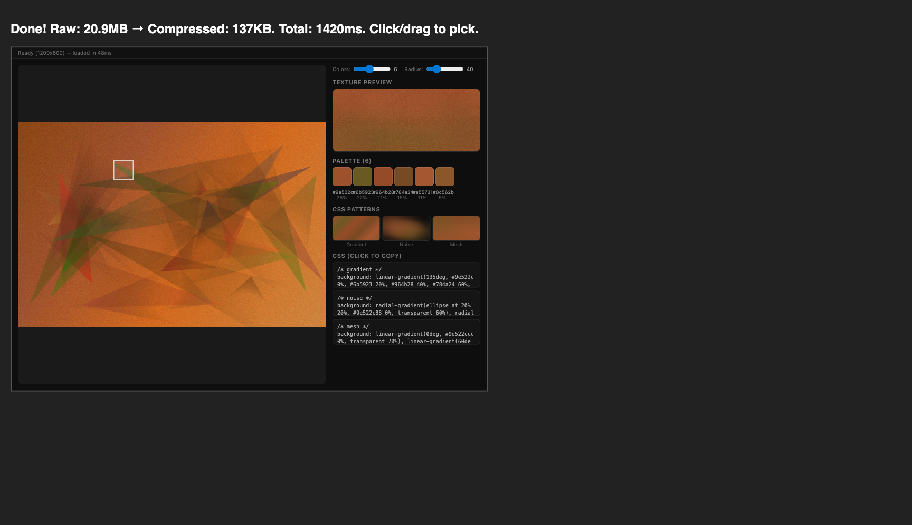

# Gritt

MCP app that extracts organic color textures from images. Instead of picking a single flat color, select a region and get a palette of naturally varied colors with ready-to-use CSS (gradients, noise, mesh).

Works with Claude Desktop and any MCP client that supports [MCP Apps](https://github.com/modelcontextprotocol/ext-apps).



## Install

```bash
npm install && npm run build
```

Add to Claude Desktop config (`~/Library/Application Support/Claude/claude_desktop_config.json`):

```json
{
  "mcpServers": {
    "gritt": {
      "command": "node",
      "args": ["/path/to/gritt/build/main.js"]
    }
  }
}
```

## How it works

1. Provide a base64-encoded image to the `color_texture_picker` tool
2. Click or drag on the image to select a region
3. Get an extracted palette with texture preview, CSS gradients, noise patterns, and mesh blends
4. Click any swatch or CSS block to copy

Server-side compression via sharp (optional) keeps the UI fast regardless of input image size.

## Stack

- [MCP Apps Extension](https://github.com/modelcontextprotocol/ext-apps) for the interactive UI
- Client-side k-means clustering for instant color analysis
- Canvas-based texture preview rendering
- Vite + vite-plugin-singlefile for single-file HTML output
